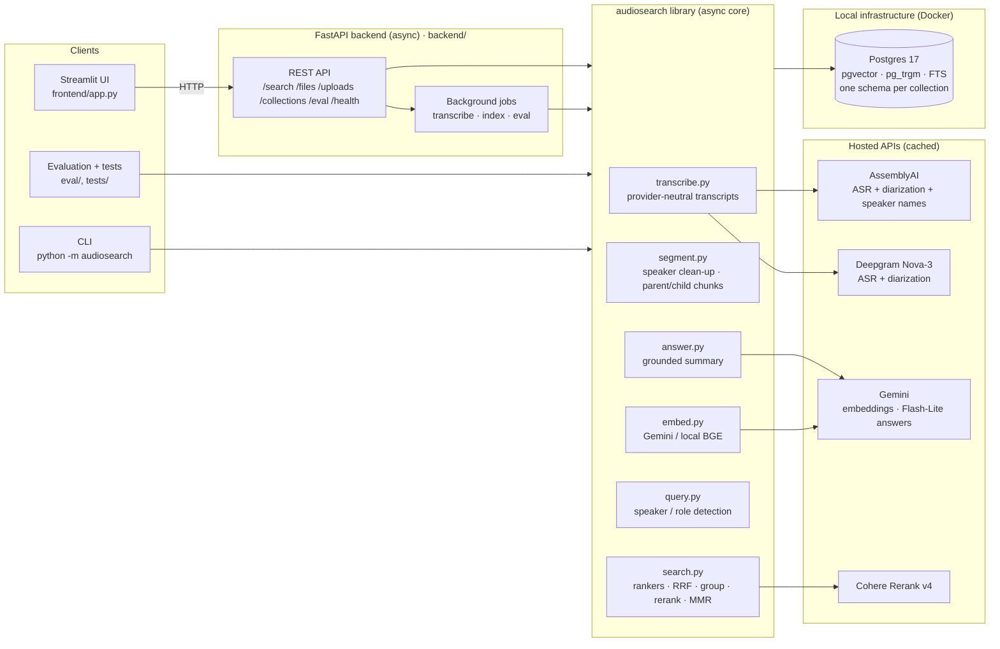
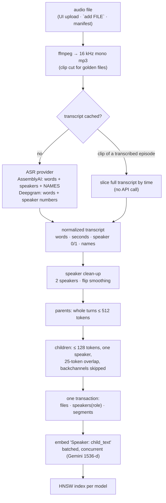
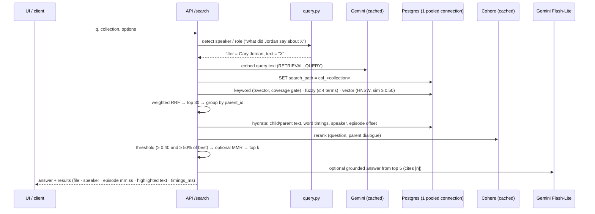
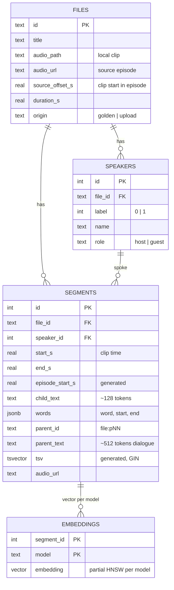

# Architecture

## 1. Components

* The **UI is a pure HTTP client**: no database or model access, so it can be replaced.
* The **backend** owns the async connection pool (2–10 connections) and the loaded models; slow
  work (transcription, embedding, evaluation) runs as background jobs that clients poll.
* The **core library** is used directly by the CLI, evaluation and tests, so recall numbers measure
  retrieval, not HTTP.
* **Hosted calls are cached on disk** (`.cache/`: query embeddings, rerank scores, answers;
  `data/transcripts/`: raw and normalized ASR output), so re-runs are free and reproducible.
* **Logs:** one rotating text file per process in `logs/`; every line carries a request or job id.

## 2. Ingestion

## 3. Query path

## 4. Data model (per collection schema `col_<name>`)

`public.collections(name, description, created_at)` registers the collections; every collection is
created from the same `audiosearch/schema.sql`, so columns are identical. Queries select a
collection with `search_path`, and the path is reset when the connection returns to the pool.

## 5. Key parameters (`audiosearch/config.py`, overridable in `.env`)

| Parameter | Value | Why |
|---|---|---|
| `CHILD_TOKENS` / overlap / `PARENT_TOKENS` | 128 / 25 / 512 (tiktoken cl100k) | ~40–60 s children in one speaker's turn; 2–3 min parents keep a question and its answer together |
| `MIN_CHILD_WORDS` | 3 | backchannels ("Right.") stay in the parent, not as results |
| RRF k, weights | 60; keyword 1.0, vector 1.0, fuzzy 0.5 | rank-only fusion; typo ranker down-weighted |
| `FUZZY_MAX_TERMS` | 4 | trigram only for short lookups (measured ~30 ms scan, 0 semantic recall) |
| `VECTOR_MIN_SIM` | 0.50 | safety floor; cosine doesn't separate relevant from irrelevant (measured) |
| `RERANK_MIN_SCORE` / `_RELATIVE` | 0.40 / 0.5 × best | calibrated: answers 0.64–0.97, junk 0.26–0.30 |
| `RERANK_DEPTH` | 30 | candidates re-scored per query |
| `MMR_LAMBDA` | 0.6 | relevance versus diversity when MMR is on |
| `DB_POOL_MIN/MAX` | 2 / 10 | one connection per search, held for milliseconds |
| `EMBEDDER` / dims | gemini-embedding-001 / 1536 | HNSW supports ≤ 2000 dims; `bge-base` for local |
| `ANSWER_MODEL` | gemini-3.5-flash-lite | 2.5-flash-lite is no longer available to new users |

## 6. Multi-tenancy and scaling

* **Tenants = collections** (one Postgres schema each, identical tables, per-collection indexes).
  Users create their own knowledge base via UI / `POST /collections` / CLI, then upload and
  search inside it; isolation is enforced by `search_path` per connection and covered by a test.
* **Capacity levers:** `DB_POOL_MIN/MAX` (one connection per search, held for milliseconds),
  `HTTP_MAX_CONNECTIONS`, `EMBED_CONCURRENCY`, `INGEST_CONCURRENCY`, `JOB_CONCURRENCY`, and uvicorn
  workers or replicas. Current: p50 186 / p90 274 / p99 371 ms at concurrency 5 on one worker.
* **Next steps at scale:** durable job queue (Postgres jobs table or a worker queue) instead of
  in-memory jobs; PgBouncer and read replicas; HNSW tuning; moving large tenants to their own database;
  a self-hosted reranker to remove third-party rate limits.
